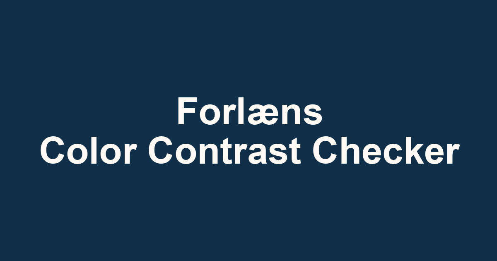

# Color Contrast

[](https://github.com/forlaens/ColorContrast/actions/workflows/tests.yml)
[](LICENSE)

An accessible image contrast checker by [Forlæns](https://forlaens.com/).

[Use Color Contrast](https://colorcontrast.forlaens.com)



The app lets someone upload or drop in an image, choose a text/icon/background color, and highlight image areas where that color may be hard to read or see. It is intentionally static at runtime: PHP is only used as a source template during local development and build rendering.

## Project Layout

- `app/` is the production source: PHP templates, CSS, JavaScript, images, PWA files, and `.htaccess`.
- `app/include/layout/` contains the shared document head and script includes.
- `app/js/` contains small plain-JavaScript modules loaded in order. They share a few globals because the deployed app is bundled into one static file.
- `scripts/` contains build, cleanup, asset generation, and syntax checks.
- `test/` contains structure, HTML, feature, Alfa, and axe accessibility tests.
- `dist/` is generated by `npm run build` and is the deployable web root. Do not edit it by hand.

## Client Modules

- `util.js` provides shared DOM helpers, storage keys, safe localStorage access, status announcements, and numeric rounding.
- `i18n.js` owns supported languages, translated UI strings, language persistence, and translated attributes such as `aria-label`.
- `app.js` owns view routing, the accessibility statement view, error display, loading state, intro panel state, and theme preference.
- `image.js` owns file input, drag/drop, thumbnail preview, image decoding, canvas sizing, and cached source pixels.
- `canvas.js` contains canvas access, rendering, drawing, and keyboard handling for the color picker crosshairs.
- `toolbar.js` owns the checker toolbar state, selected test color, reset action, and crosshair placement.
- `contrast.js` performs the pixel-by-pixel contrast highlight pass.
- `color.js` contains RGB/hex conversion, pixel sampling, luminance, and contrast-ratio math.
- `pwa.js` registers the service worker.

The load order in `app/include/layout/foot.php` matters. If a module starts using a helper from another module, keep the helper module earlier in that list and in `scripts/build.mjs`.

## Build Pipeline

`npm run build` performs the production build:

1. Runs syntax checks for JavaScript and PHP.
2. Regenerates the social card image.
3. Copies source assets into `dist/`.
4. Renders `app/index.php` to static HTML with `scripts/render-page.php`.
5. Inlines CSS into the rendered HTML.
6. Bundles the small JavaScript files into `dist/js/app.bundle.js`.
7. Updates the service worker cache list for the bundled release.
8. Removes unused source PNG step illustrations from `dist/`.

Production builds default to `https://colorcontrast.forlaens.com`. Override `SITE_URL` only when building for another host:

```sh
SITE_URL=https://colorcontrast.forlaens.com npm run build
```

## Commands

```sh
npm run dev
npm run check
npm run test:html
npm run test:structure
npm run test:accessibility
npm test
npm run build
npm run clean
```

`npm run dev` starts a hot-reload dev server at `http://127.0.0.1:8000`. Changes to app files automatically rebuild and refresh the browser.

`npm run check` validates JavaScript and PHP syntax.

`npm run test:html` validates the rendered HTML.

`npm run test:structure` builds the static app and checks rendered HTML structure, including headings, landmarks, footer links, and PWA metadata.

`npm run test:accessibility` builds the static app and runs Siteimprove Alfa plus axe-core checks through Playwright. These checks target WCAG AAA and accessibility best-practice coverage.

`npm test` runs the full local test suite.

`npm run analyze:bundle` prints a bundle size breakdown using the generated source map.

`npm run analyze:assets` reports the built JS bundle size and the unminified CSS size.

## Change Guidelines

- Keep the interface simple and avoid adding explanatory UI when existing labels or short copy can do the job.
- Keep all user-facing strings in `app/js/i18n.js`, including `aria-label` text.
- Keep focus behavior intentional. `:focus-visible` is used for normal controls, and the main landmark only receives visible focus after the skip link is used.
- Prefer small plain-JavaScript helpers over new dependencies. The app should stay fast and easy to deploy as static files.
- Run `npm test` before opening a PR.

## License

Color Contrast is available under the [MIT License](LICENSE).
